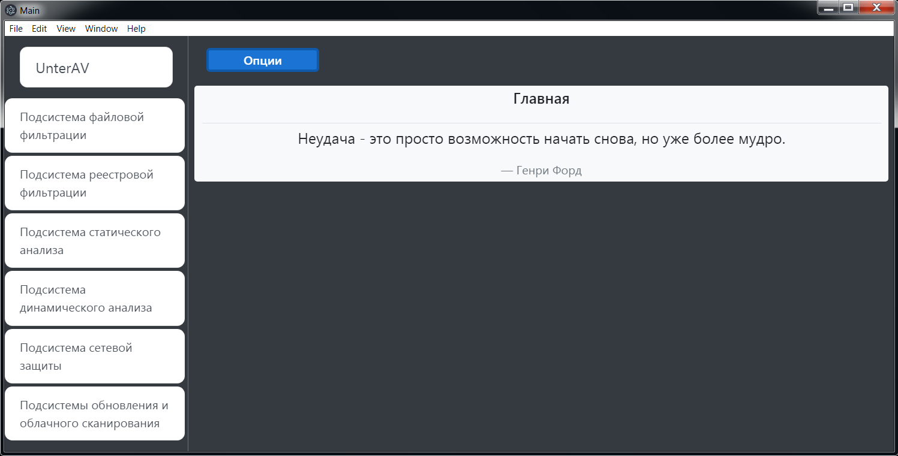

# antivirus-electronjs

# Install

1. Install [Nodejs](https://nodejs.org/en/download/).
2. Install [Electronjs](https://www.electronjs.org/docs/tutorial/installation).
3. Copy files /path/to/your/project.
4. Install [Sqlite3](https://www.npmjs.com/package/sqlite3).
5. Install [popper.js](https://www.npmjs.com/package/popper.js).
6. Install [bootstrap](https://www.npmjs.com/package/bootstrap).
7. Install [jquery](https://www.npmjs.com/package/jquery).
8. Install [regedit](https://www.npmjs.com/package/regedit).
9. Install [node-notifier](https://www.npmjs.com/package/node-notifier).
10. Install [unzipper](https://www.npmjs.com/package/unzipper).
11. Init system database like : 

> node database.js

12. To update component using :

> node updateclient.js

# ToChange

1. In *cloud_systeml.html* change path, ip , port to your *'Cuckoo scanner'*. 
2. In *database.js change* path to your system database.
3. In *dynamic_analize.html* change path to your *drltrace.exe*.
4. In *index.js* name of your namedpipe.
5. In *initpage.js* path to your database.
6. In *log.js* change path to your log file.
7. In *regestry.js* change path your regestry keys.
8. In *static_analize.html* change path to your *Static_Analysis_Subsystem.exe*.
9. In *updateclient.js* change ip address of *Update Server*. 

# Result

